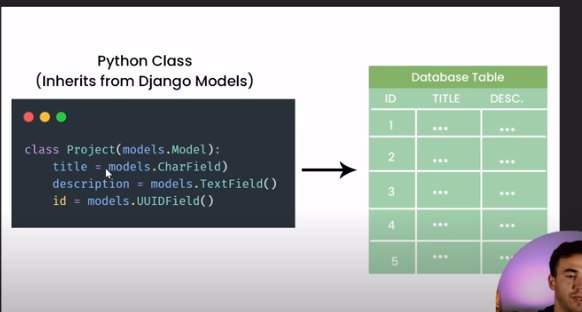

# What is Django?

A python framework for Backend Development

## Companies that use Django

    - Pinterest
    - Instagram
    - Spotify
    - Youtube
    - Udemy

# Building APIs with django is easy, because of the rest django built in framework django has

## Django uses the MVT Design Pattern which means graphically

# Source Code [here](https://github.com/divanov11/StudyBud/)

# Command to start an app with django

`django-admin startproject studybud`

- studybud being the name of the project
- then change directory to the app name

`cd studybud`

- and run

`python manage.py runserver`

- this will start the server on http://127.0.0.1:8000

- then run inside the studybud folder again

`python manage.py startapp base`

and it will create a folder called base inside the studybud folder

then add 'base.apps.baseConfig' inside settings.py in the boilerplate

# To set templates, create a templates folder inside the root directory

# then include it in the settings.py folder in the in Templates and DIR part.

# Data Models are mostly classes

Don't forget to do

`python manage.py migrate`
